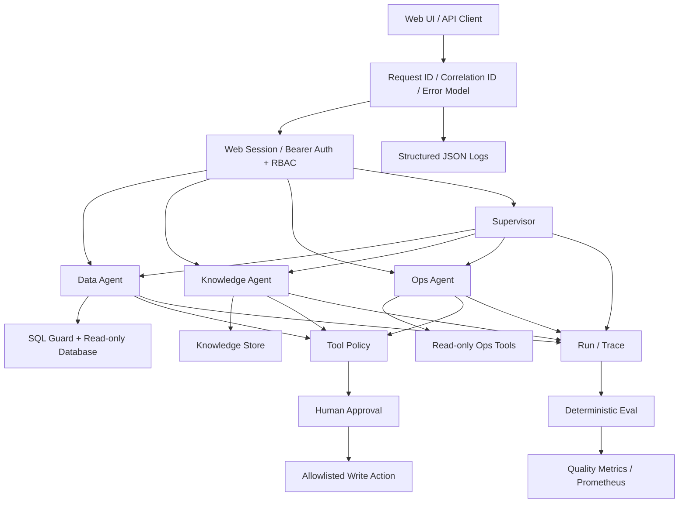
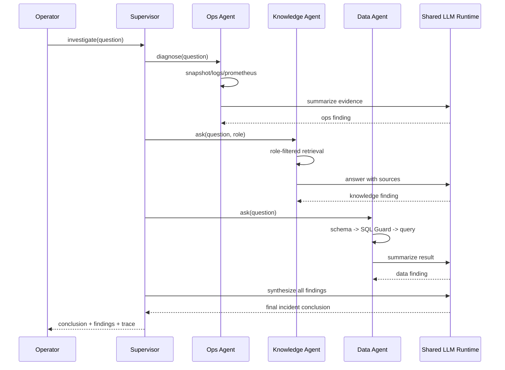
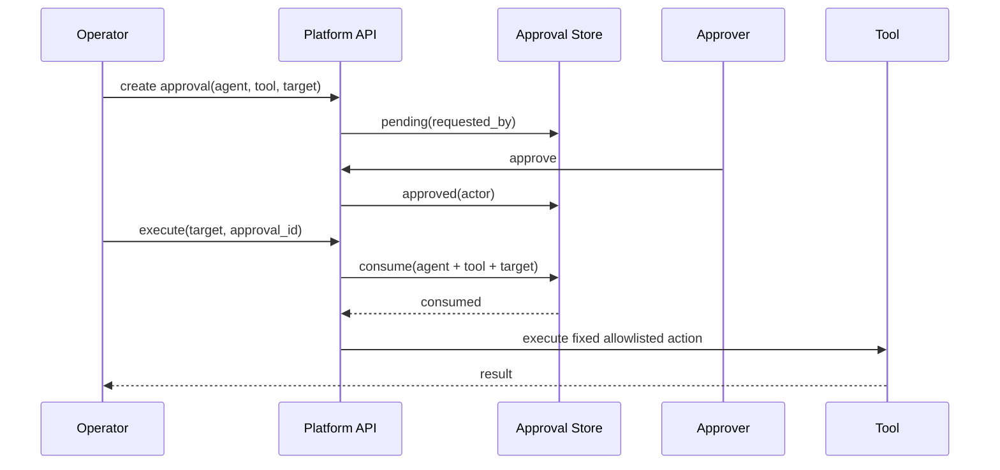

# 系统架构

## 系统总览



## Dynamic Agent Platform

从 v0.2 开始，Agent 不再只是代码中的固定类，而是由平台持久化管理的资源：

```text
Agent Definition
      │
      ├── name / slug / type / status
      ├── built_in
      └── published_version
               │
               ▼
        Agent Version
        ├── instructions
        ├── model
        ├── temperature
        ├── max_steps
        ├── timeout
        ├── tool_config
        ├── knowledge_config
        ├── data_config
        └── guardrail_config
```

生命周期：

```text
Create Agent
    ↓
Draft v1
    ↓
Playground
    ↓
Publish
    ↓
Published v1
    ↓
Create Draft v2
    ↓
Publish / Roll back
```

Published Version 不允许原地修改。所有 Run 会记录 `agent_id + agent_version`，从而可以追溯一次执行到底使用了哪一版配置。

Data / Knowledge / Ops / Supervisor 目前作为 Built-in Agent Definition 预置到同一套 Store；Custom Agent 通过统一 Runtime Adapter 执行 Published Version。Tool Registry 会在下一阶段把当前 Runtime Adapter 中的领域 Tool 绑定进一步资源化。

Agent Definition / Version 使用 SQLAlchemy + Alembic。Compose 环境下通过 PostgreSQL 保存；单进程演示环境仍允许 SQLite，以保持本地启动成本低。

## 跨 Agent 故障调查



当前 Supervisor 采用串行委派。这样 Demo 的执行模型更简单、确定性更强、Trace 顺序也更清楚。只有真实 P95 数据证明并行化收益足够大时，才值得引入额外并发复杂度。

## 高风险写操作流程



Approval ID 只能使用一次，并绑定精确的 `Agent + Tool + Target`。即使模型被 Prompt Injection，也不能把“已批准的固定动作”扩展成任意 Shell 命令。

## 安全边界

| 边界 | 实现方式 |
| --- | --- |
| 用户身份 | Web Session（HttpOnly Cookie）+ Bearer Token |
| API 权限 | RBAC：user / operator / approver / admin |
| Agent 能力 | Tool Policy Registry |
| SQL 执行 | SQL Guard + 推荐数据库只读账号 |
| Knowledge 可见范围 | 按角色过滤文档 |
| 高风险写操作 | Human Approval + 单次消费 + Target 绑定 |
| Ops 命令 | 固定参数 / 服务端 Allowlist |
| 请求追踪 | X-Request-ID + X-Correlation-ID 写入 Agent Run |
| API 错误 | 统一 Error Envelope + 稳定错误码 + Request Context |
| API 滥用 | 单进程按客户端 IP 限流；多副本升级为 Gateway/共享限流 |
| Secret | `.env` gitignore、LLM Key 使用 `SecretStr`、生产配置校验 |
| Health | Liveness 只看进程；Readiness 检查 DB / Platform Store / Knowledge Store |
| Audit | Run/Trace + Approval requester/actor/executor |
| Prompt 数据留存 | 默认不把原始用户问题写入 Run History |

## 持久化

| 数据 | 当前存储 | 生产升级路径 |
| --- | --- | --- |
| Demo 业务数据 | SQLite / 外部 SQLAlchemy 数据库 | PostgreSQL / Kingbase |
| Knowledge Chunk + Embedding | SQLite | pgvector / 托管向量数据库 |
| Agent Definition / Version | PostgreSQL（Compose）/ SQLite（轻量 Demo） | PostgreSQL |
| Runs / Approvals | SQLite（v0.1 兼容） | v0.3 Async Runtime 时迁 PostgreSQL |
| Auth Identity | 配置 Token Map + 进程内 Web Session | OIDC / 企业 IdP + 共享 Session Store |

当前使用 SQLite 是为了让 Demo 自包含，而不是认为 SQLite 适合所有生产场景。平台接口层保留了迁移路径，避免在没有规模证据时提前引入基础设施。

## 故障模型

- Data Agent 对无效/执行失败 SQL 最多重试 `agent_max_attempts` 次。
- Supervisor 会记录失败的 Child Finding，并在其他 Agent 成功时继续综合。
- 只有所有 Child Agent 都失败时 Supervisor 才整体失败。
- Ops 诊断会把 Prometheus / Docker / Kubernetes 等可选依赖失败写入 Trace，而不是静默吞掉。
- Eval 会检查关键 Step 缺失和 Trace Error。
- CI 会执行编译、测试、依赖一致性和漏洞审计。

## 扩展路径

1. 静态 Bearer Token 升级为 OIDC/JWT。
2. Agent Definition / Version 已开始迁 PostgreSQL；Runs / Approvals 在 Async Runtime 阶段统一迁移。
3. 当知识库规模/P95 有真实压力时，把 O(n) Embedding Scan 替换为 pgvector。
4. 除 Role Scope 外加入 Tenant/User ACL Predicate。
5. 当故障调查延迟成为实际瓶颈时并行化 Supervisor。
6. 多副本环境把 Rate Limit 迁到 API Gateway/Redis，并接入 Secret Manager。
7. 增加告警路由和生产 Retention Policy。
