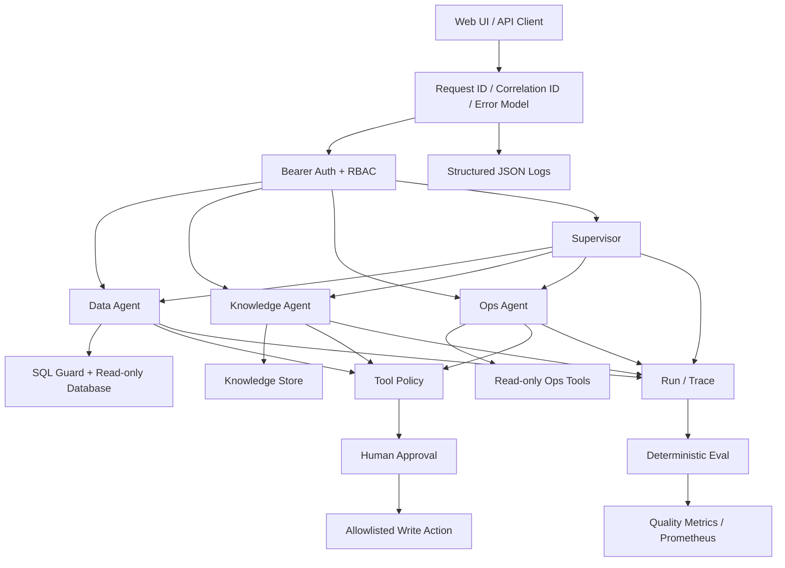
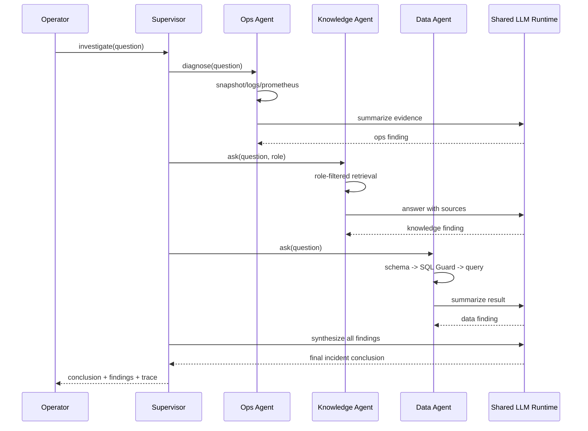
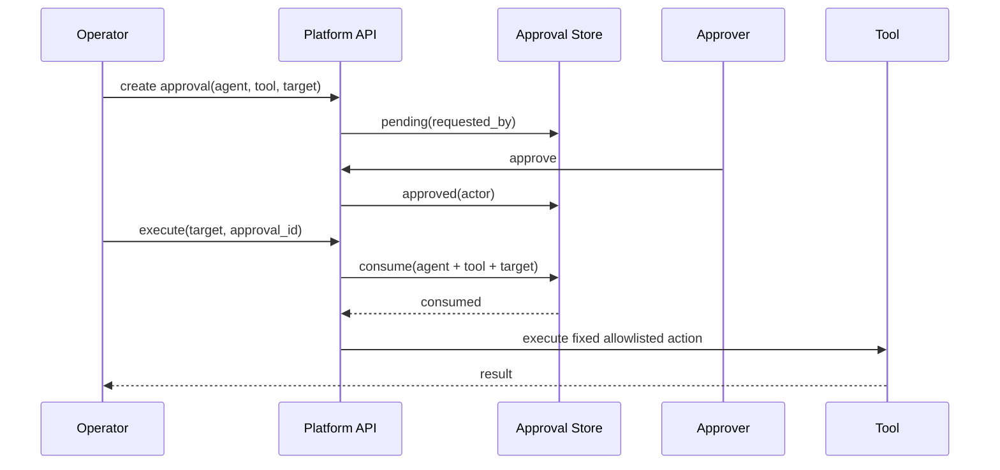

# Architecture

## System overview

## Cross-agent incident investigation

The Supervisor currently delegates sequentially. This keeps the execution model simple and deterministic for the demo. Parallel delegation is only worth adding when real latency measurements justify the extra concurrency behavior.

## High-risk write flow

Approval IDs are single-use and bound to the exact `Agent + Tool + Target`. The model cannot create a new arbitrary shell command from an approved fixed action.

## Security boundaries

| Boundary | Enforcement |
| --- | --- |
| User identity | Bearer token authentication |
| API permissions | RBAC: user / operator / approver / admin |
| Agent capability | Tool Policy registry |
| SQL execution | SQL Guard + database read-only account recommendation |
| Knowledge visibility | role-filtered document scope |
| Risky writes | Human Approval + single-use target-bound approval |
| Ops commands | fixed arguments / server-side allowlists |
| Request tracing | X-Request-ID + X-Correlation-ID propagated into Agent Run |
| API errors | shared error envelope with stable code and request context |
| Audit | Run/Trace + approval actor/requester/executor |
| Prompt data retention | raw user question is not stored in Run history |

## Persistence

| Data | Current storage | Upgrade path |
| --- | --- | --- |
| Demo business data | SQLite / external SQLAlchemy database | PostgreSQL / Kingbase |
| Knowledge chunks + embeddings | SQLite | pgvector / managed vector DB |
| Runs / approvals | SQLite | PostgreSQL |
| Auth identities | config token map | OIDC / enterprise IdP |

The current SQLite choices are deliberate for a self-contained demo. The platform interfaces keep the migration path visible without introducing infrastructure before it is needed.

## Failure model

- Data Agent retries invalid/generated SQL up to `agent_max_attempts`.
- Supervisor records a failed child finding and continues when other agents succeed.
- Supervisor fails only when every child Agent fails.
- Ops diagnosis treats optional Prometheus/Docker/Kubernetes failures as trace errors rather than hiding them.
- Eval flags missing critical steps and trace errors.
- CI runs compile, tests, dependency consistency, and vulnerability audit.

## Scale-up path

1. Replace static bearer tokens with OIDC/JWT validation.
2. Move platform state and knowledge metadata to PostgreSQL.
3. Replace O(n) embedding scan with pgvector when measured corpus size/latency requires it.
4. Add tenant/user ACL predicates in addition to role scope.
5. Parallelize Supervisor delegation if real incident latency becomes material.
6. Add rate limiting, secrets management, alert routing, and production retention policies.
