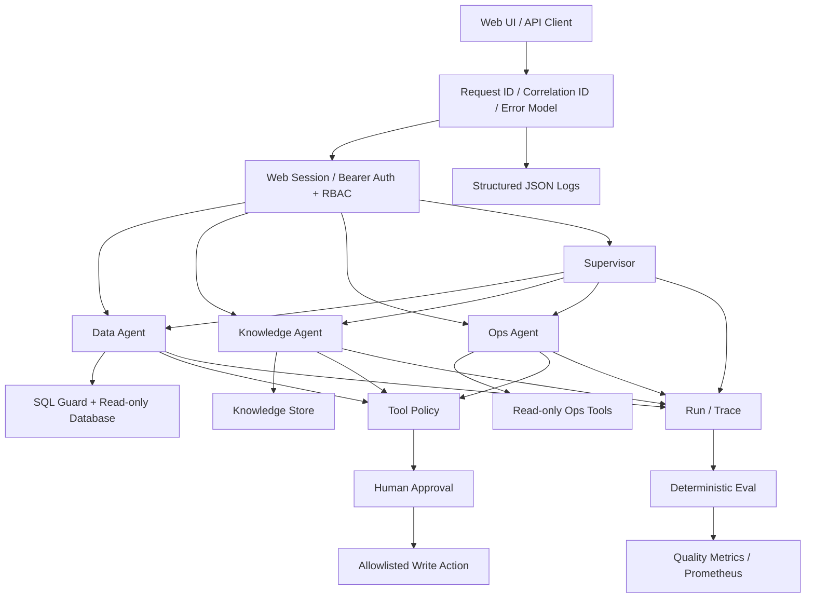
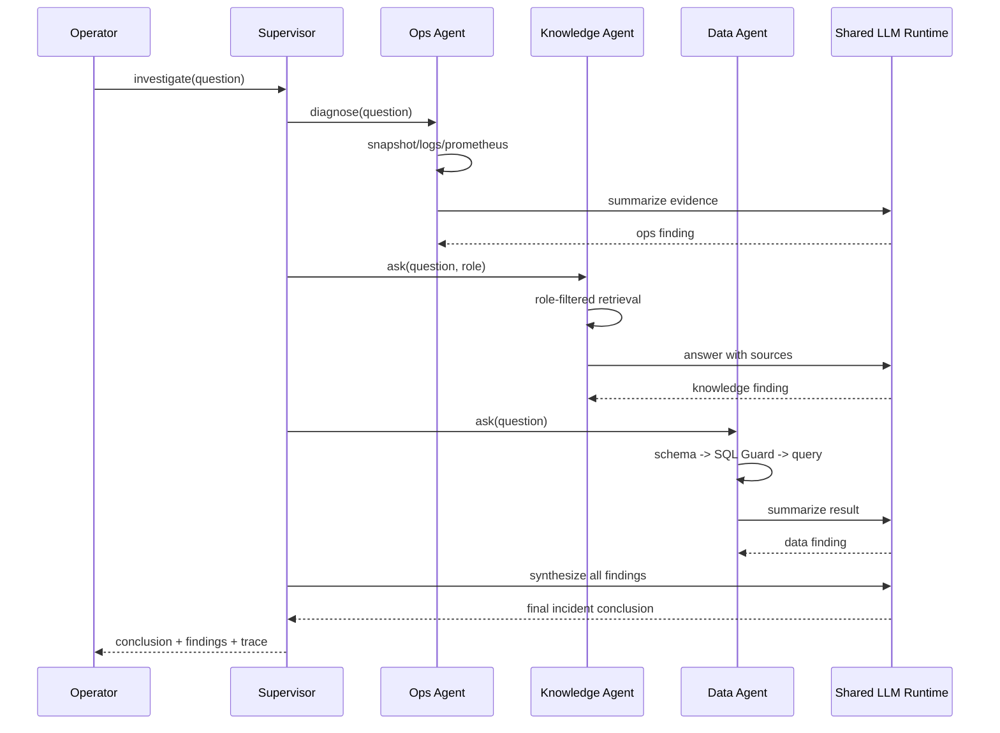
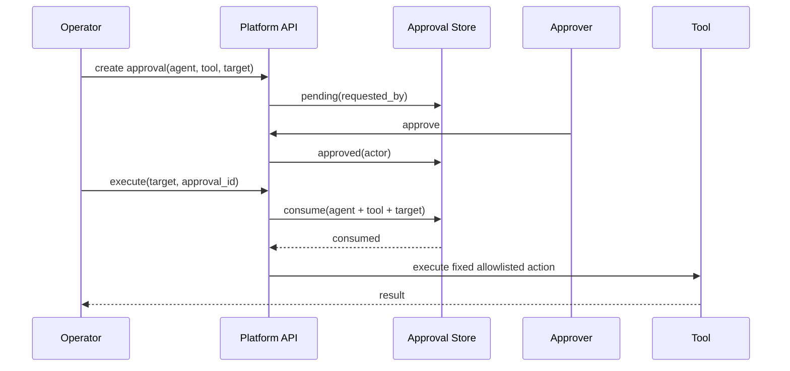

# Architecture

## System overview



## Dynamic Agent Platform

Starting with v0.2, Agent is a persisted platform resource rather than only a predefined Python object.

```text
Agent Definition
      │
      ├── name / slug / type / status
      ├── built_in
      └── published_version
               │
               ▼
        Agent Version
        ├── instructions
        ├── model
        ├── temperature
        ├── max_steps
        ├── timeout
        ├── tool_config
        ├── knowledge_config
        ├── data_config
        └── guardrail_config
```

Published versions are immutable. Editing configuration creates a new Draft Version; publishing can also point back to an older version for rollback.

Every Run records `agent_id + agent_version` so execution remains attributable to the exact configuration used.

Data, Knowledge, Ops and Supervisor are seeded as Built-in Agent Definitions. Generic Custom Agents execute through the shared Runtime Adapter. Tools are first-class resources and assignments are scoped to Agent Versions.

Agent Definition / Version use SQLAlchemy and Alembic. Docker Compose stores them in PostgreSQL; a lightweight SQLite fallback remains available for the standalone demo.

## Tool Platform

M2 promotes tools from a static policy list into first-class platform resources:

```text
Tool Registry
├─ key
├─ provider / type
├─ input_schema / output_schema
├─ timeout
├─ read / write
├─ risk
└─ approval_required
        │
        ▼
Agent Version
        │
        ▼
agent_tools
```

Assignments belong to an **Agent Version**, preserving immutable capability boundaries for published versions. New Draft Versions inherit the previous Tool set and can then be edited.

Execution follows:

```text
Agent Version
    ↓
Tool Request
    ↓
Registry
    ↓
Version Assignment
    ↓
Mode / Risk / Approval Policy
    ↓
Execution
```

Dedicated Data / Knowledge / Ops workspaces and the managed Agent Runtime share the same published-version Tool context. Supervisor delegation switches into each child Agent's context instead of bypassing child capability boundaries.

M2.5 now imports MCP Streamable HTTP and a restricted OpenAPI 3.x JSON GET/POST subset into the **same Tool Registry**. Server-controlled exact URL allowlists constrain the remote destinations; each imported tool must be assigned to a published Agent Version and defaults to high-risk/approval-required.

### Governed remote-tool execution

```text
MCP discovery / OpenAPI JSON import
    ↓
Tool Registry → Draft version assignment → Publish
    ↓
Generic Agent Function Calling (single operation proposal)
    ↓
waiting_approval Run (no network side effect)
    ↓
Human approval: Agent ID + Version + Tool ID + exact JSON arguments
    ↓
Single-use deterministic resume → MCP / REST endpoint
    ↓
Run / Trace
```

Arguments are canonicalized and persisted in the Approval Store. Modified arguments, cross-agent reuse, version drift, and replay are denied. This is a **synchronous single-step proposal/resume workflow**, not a persistent asynchronous run engine. Live integrations, outbound network policies, credentials, and idempotency still require production verification.

See [Development Progress](/en/PROGRESS), [MCP integration](/mcp-integration), and [OpenAPI integration](/openapi-integration).

## Cross-agent incident investigation



The Supervisor currently delegates sequentially. This keeps the execution model simple and deterministic for the demo. Parallel delegation is only worth adding when real latency measurements justify the extra concurrency behavior.

## High-risk write flow



Approval IDs are single-use and bound to `Agent + Tool + Target`. Remote MCP/OpenAPI approvals additionally bind exact JSON arguments, Agent ID, and published Version. The model cannot create a new arbitrary shell command from an approved fixed action.

## Security boundaries

| Boundary | Enforcement |
| --- | --- |
| User identity | Web Session (HttpOnly Cookie) + Bearer token authentication |
| API permissions | RBAC: user / operator / approver / admin |
| Agent capability | Tool Policy registry |
| SQL execution | SQL Guard + database read-only account recommendation |
| Knowledge visibility | role-filtered document scope |
| Risky writes | Human Approval + single-use target-bound approval |
| Ops commands | fixed arguments / server-side allowlists |
| Request tracing | X-Request-ID + X-Correlation-ID propagated into Agent Run |
| API errors | shared error envelope with stable code and request context |
| API abuse | per-process client-IP rate limit; gateway/shared limiter for multi-replica deployments |
| Secrets | `.env` ignored, `SecretStr` for LLM key, auth tokens excluded from Settings repr, production config validation |
| Health | liveness is process-only; readiness checks database + platform store + knowledge store |
| Audit | Run/Trace + approval actor/requester/executor |
| Prompt data retention | raw user question is not stored in Run history |

## Persistence

| Data | Current storage | Upgrade path |
| --- | --- | --- |
| Demo business data | SQLite / external SQLAlchemy database | PostgreSQL / Kingbase |
| Knowledge chunks + embeddings | SQLite | pgvector / managed vector DB |
| Agent Definition / Version | PostgreSQL (Compose) / SQLite (lightweight demo) | PostgreSQL |
| Tool Registry / Agent Tool Assignment | same Agent Platform Store | PostgreSQL |
| Runs / approvals | SQLite compatibility store | PostgreSQL with Async Runtime |
| Auth identities | config token map + in-memory Web Session | OIDC / enterprise IdP + shared session store |

The current SQLite choices are deliberate for a self-contained demo. The platform interfaces keep the migration path visible without introducing infrastructure before it is needed.

## Failure model

- Data Agent retries invalid/generated SQL up to `agent_max_attempts`.
- Supervisor records a failed child finding and continues when other agents succeed.
- Supervisor fails only when every child Agent fails.
- Ops diagnosis treats optional Prometheus/Docker/Kubernetes failures as trace errors rather than hiding them.
- Eval flags missing critical steps and trace errors.
- CI runs compile, tests, dependency consistency, and vulnerability audit.

## Scale-up path

1. Replace static bearer tokens with OIDC/JWT validation.
2. Move platform state and knowledge metadata to PostgreSQL.
3. Replace O(n) embedding scan with pgvector when measured corpus size/latency requires it.
4. Add tenant/user ACL predicates in addition to role scope.
5. Parallelize Supervisor delegation if real incident latency becomes material.
6. Move rate limiting to API Gateway/Redis for multi-replica deployments and integrate a real Secret Manager.
7. Add alert routing and production retention policies.
